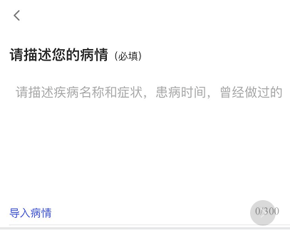

### ios textarea标签的placeholder属性多行时被隐藏

在ios手机上，当删除输入的文字后，placeholder显示不全，只有键盘收回的时候，才可以显示,如图所示：
正常期待的显示结果：

删除输入文字后的显示结果:

导致原因不明确-猜测如下：

    1. ios抖动问题

    2. textarea需要重新渲染

#### 针对重新渲染的方式来解决此问题：
   
    1.改变css样式
   
    2.重新替换placeholder

### 具体解决方案如下：

样式:

    ``
    .rerender{
        position:relative;
    }
    ``

   模板：
    
    <textarea
    @input = handleInput(e.target.value)
    :placeholder="placeholder"
    maxlength="300"
    class="fang-textarea"></textarea>
    
    
方法：

    handleInputp(_val){
        if(!_val.trim()){
            <!-- 解决方案-1改变样式 -->
            document.querySelector('.fang-textarea').addClass('rerender')
            <!-- 解决方案-2替换placeholder -->
            document.querySelector('.fang_textarea').setAttribute('placeholder','本该展示的完整的placeholder')
        }
    }
    ` `
    搬运过来 https://blog.clevercoder.ltd/?id=132

